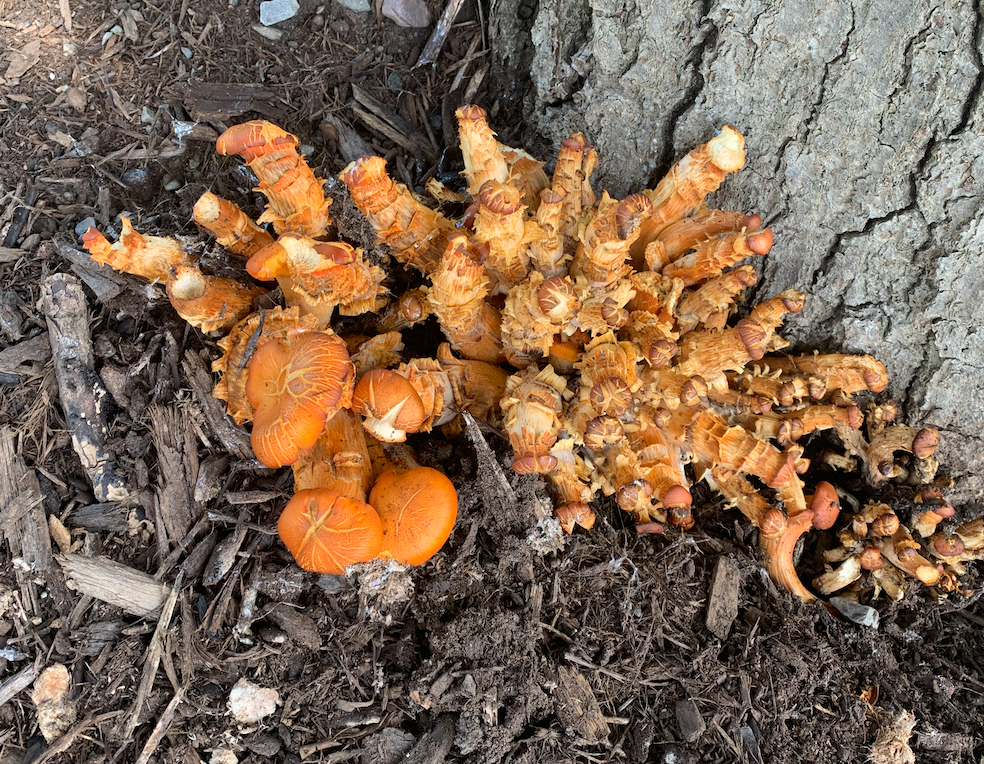

```{r setup, include = FALSE}
knitr::opts_chunk$set(echo = FALSE)
```


# Foraging Foray

A coding collaboration between  
  - [Cole Hauser](https://github.com/chhauser)  
  - [Tobias Mueller](https://github.com/tobiasgmueller)

<br>

